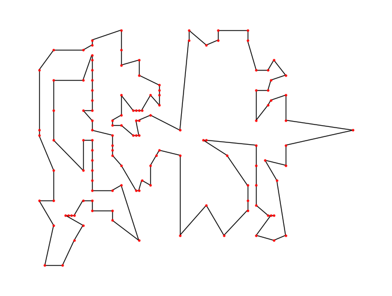
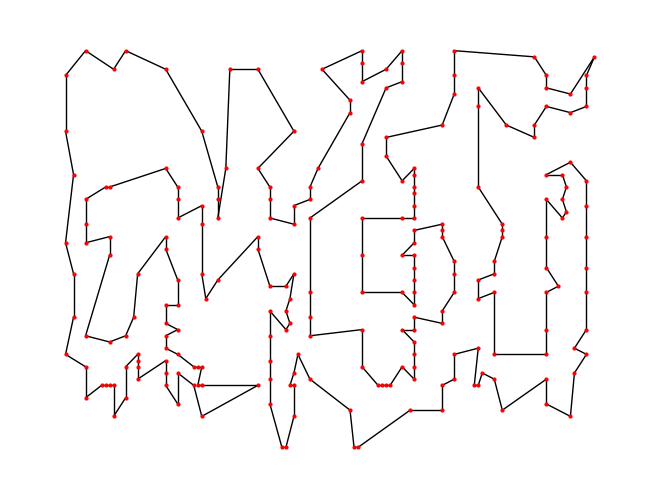
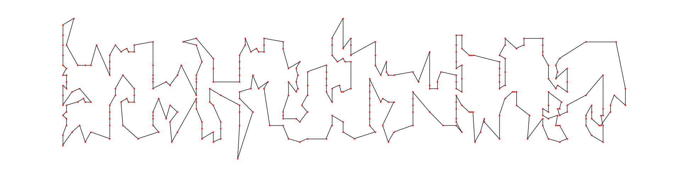
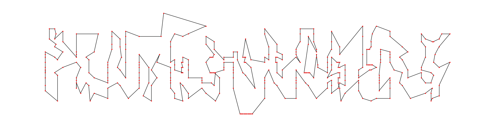
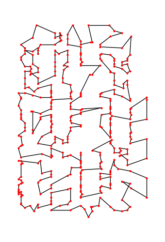

---
 

### **<u>131 VLSI Data Points:</u>**
Optimal Path   (length = 564)            |  Our Output by SA   (length = 646)
:-------------------------:|:-------------------------:
  |  

 

### <u>**237 VLSI Data Points:**</u>
Optimal Path (length = 1019)            |  Our Output by SA (length = 1156)
:-------------------------:|:-------------------------:
  |  

 

### **<u>343 VLSI Data Points:</u>**
Optimal Path (length = 1368)            |  Our Output by SA (length = 1464)
:-------------------------:|:-------------------------:
  |  

 

### **<u>379 VLSI Data Points:</u>**
Optimal Path (length = 1332)            |  Our Output by SA (length = 1518)
:-------------------------:|:-------------------------:
  |  

 

### **<u>380 VLSI Data Points:</u>**
Optimal Path (length = 1621)            |  Our Output by SA (length = 1518)
:-------------------------:|:-------------------------:
  |  

---
 
 

### **<u>Rajasthan dataset</u>**:
Initial Random Path  (5272.22 km)           |  Output by SA   (2148.81 km)
:-------------------------:|:-------------------------:
  |  

---
## <u>⚠ **CAUTION**</u>:
© You must take permission from me before using this code in your work/project.  
Following attributes are mandatory:  
GitHub: https://github.com/webintellectual/Travelling-Salesman-Problem-busted-with-AI  
Linkedin: 
- https://www.linkedin.com/in/akshay-189a48200/  
- https://www.linkedin.com/in/ankur-kumar-shukla-3581b11b8/  
- https://www.linkedin.com/in/kalash-kala/
- https://www.linkedin.com/in/keshav-garg-885238202/

Medium: https://medium.com/@warriorak77  

---

### **MY REFERENCES**:
Helped in code implementation:

- [Haversine formula](https://www.geeksforgeeks.org/program-distance-two-points-earth/) to calculate distance b/w two locations using latitude and longitude values.
- [TSP implementation](https://github.com/pratikiiitv/cs302/blob/main/tsp_sa.m) on random data set by [Dr. Pratik Shah](https://pratikiiitv.github.io/)
- For conversion of longtidue, latitude to x-y cordinates: https://gis.stackexchange.com/questions/212723/how-can-i-convert-lon-lat-coordinates-to-x-y
- [TSPLIB 95](https://pypi.org/project/tsplib95/) python library by [Robert Grant](https://github.com/rhgrant10)

[VLSI Datset](https://www.math.uwaterloo.ca/tsp/vlsi/index.html) provided by [Andre Rohe](https://www.linkedin.com/in/andre-rohe-647521/)
